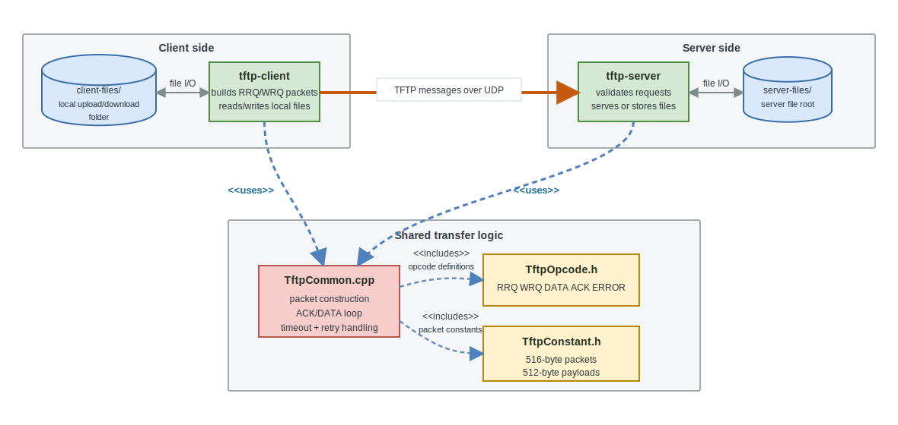
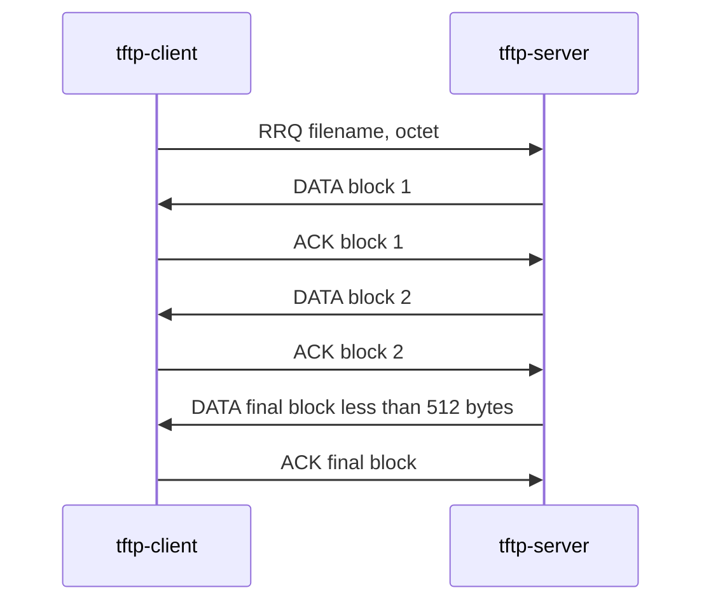
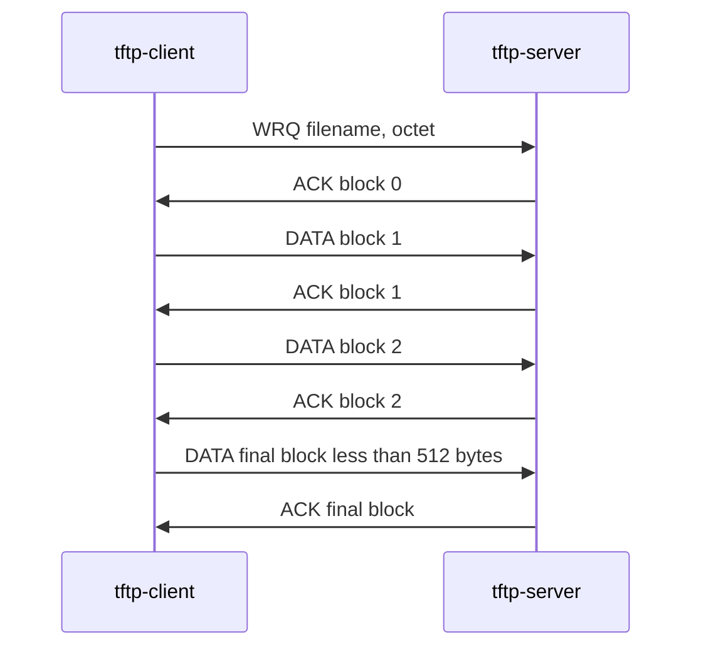

# UDP TFTP File Transfer

A small C++17 implementation of a Trivial File Transfer Protocol style client and server over UDP. The project supports reading files from the server, writing files to the server, fixed-size DATA blocks, ACK-based sequencing, error packets, and timeout-driven retransmission.

This repository was built for CSS 432 networking coursework, but the code is organized as a standalone CMake project with two executables:

- `tftp-server`: listens for UDP requests and serves files from `server-files/`
- `tftp-client`: sends read or write requests and uses `client-files/`

## Features

- UDP socket communication on localhost port `61125`
- TFTP-style opcodes: `RRQ`, `WRQ`, `DATA`, `ACK`, and `ERROR`
- Octet/binary transfer mode
- 512-byte data payloads with 516-byte maximum packets
- Sequential block numbers and ACK validation
- Timeout and retry support using `SIGALRM`
- Error responses for missing files, existing destination files, and illegal opcodes
- Text and binary file transfer test fixtures

## Architecture



The diagram separates file storage, executable processes, shared transfer logic, and protocol constants. The thick orange connection is the network boundary: the client sends TFTP-style `RRQ`, `WRQ`, `DATA`, `ACK`, and `ERROR` packets to the server over UDP at `127.0.0.1:61125`. Dashed blue arrows from the client and server into `TftpCommon.cpp` represent UML-style `<<uses>>` dependencies on shared transfer code.

The architecture image is stored at [docs/diagrams/architecture.svg](docs/diagrams/architecture.svg).

## Repository Layout

```text
.
|-- CMakeLists.txt          # CMake build configuration
|-- TftpClient.cpp          # Client CLI and initial request handling
|-- TftpServer.cpp          # Server listener and request handling
|-- TftpCommon.cpp          # Shared packet, timeout, send, read, write logic
|-- TftpOpcode.h            # TFTP opcode constants
|-- TftpError.h             # Project error constants
|-- TftpConstant.h          # Packet, retry, and folder constants
|-- docs/
|   |-- protocol.md         # Protocol and packet documentation
|   `-- diagrams/
|       |-- architecture.svg
|       `-- tftp-transfer.drawio
`-- .github/workflows/      # Test scripts and fixture files
```

## Prerequisites

- Linux or another POSIX-like environment with BSD sockets
- CMake 3.26 or newer
- A C++17 compiler such as `g++` or `clang++`

The code uses headers such as `sys/socket.h`, `netinet/in.h`, `arpa/inet.h`, `unistd.h`, and signal APIs, so it is intended for Unix-like systems.

## Build

Use an out-of-source build directory:

```bash
cmake -S . -B build
cmake --build build
```

The build creates:

```text
build/tftp-server
build/tftp-client
```

CMake also copies the fixture folders into the build directory:

```text
build/server-files/
build/client-files/
```

Run the programs from the build directory so those relative folders resolve correctly.

## Usage

Open two terminals.

Terminal 1:

```bash
cd build
./tftp-server
```

Terminal 2:

```bash
cd build
./tftp-client r server-to-client-small.txt
```

The command above downloads `server-files/server-to-client-small.txt` from the server into `client-files/server-to-client-small.txt`.

To upload a file from the client to the server:

```bash
cd build
./tftp-client w client-to-server-small.txt
```

The upload command reads `client-files/client-to-server-small.txt` and writes `server-files/client-to-server-small.txt`.

## Transfer Flows

### Read Request



### Write Request



A transfer finishes when the sender transmits a DATA packet with fewer than 512 payload bytes. Empty files are represented by a DATA packet with no payload.

## Packet Format

The implementation follows the core TFTP packet shapes:

| Packet | Opcode | Format |
| --- | ---: | --- |
| RRQ | `1` | `opcode filename 0 mode 0` |
| WRQ | `2` | `opcode filename 0 mode 0` |
| DATA | `3` | `opcode block data` |
| ACK | `4` | `opcode block` |
| ERROR | `5` | `opcode error-code message 0` |

All numeric fields are written in network byte order with `htons`.

More details are in [docs/protocol.md](docs/protocol.md).

## Error Handling

The server sends `ERROR` packets for common invalid requests:

- File not found on read requests
- Destination file already exists on write requests
- Illegal opcode values

The transfer loop also terminates when an `ERROR` packet is received during a read or write.

## Timeout and Retransmission

Shared send logic sets a one-second alarm before waiting for a response. If `recvfrom` is interrupted by the alarm, the retry counter is incremented and the packet is sent again until `MAX_RETRY_COUNT` is reached.

Relevant constants are defined in `TftpConstant.h`:

```cpp
static const unsigned int MAX_PACKET_LEN = 516;
static const size_t MAX_DATA_SIZE = 512;
static const int MAX_RETRY_COUNT = 10;
static const int RETRY_SECONDS = 1;
```

## Test Scripts

After building, the copied test scripts can be run from the build directory:

```bash
cd build
./TestSmallFiles.sh single
./TestSmallFiles.sh continuous
./TestLargeFiles.sh single
./TestLargeFiles.sh continuous
./TestLargeFiles.sh binary
```

The scripts start the server, run client transfers, compare source and destination files with `diff`, and clean up generated destination files.

Some scripts include valgrind or assignment-specific timeout-client paths and may require additional local setup.

## Development Notes

- Keep runtime files inside `client-files/` and `server-files/` when running the binaries.
- `tftp-client r <filename>` downloads from server to client.
- `tftp-client w <filename>` uploads from client to server.
- The server currently handles requests sequentially in a single process.
- The server refuses to overwrite an existing file during upload.
- The client and server share implementation by including `TftpCommon.cpp`.
