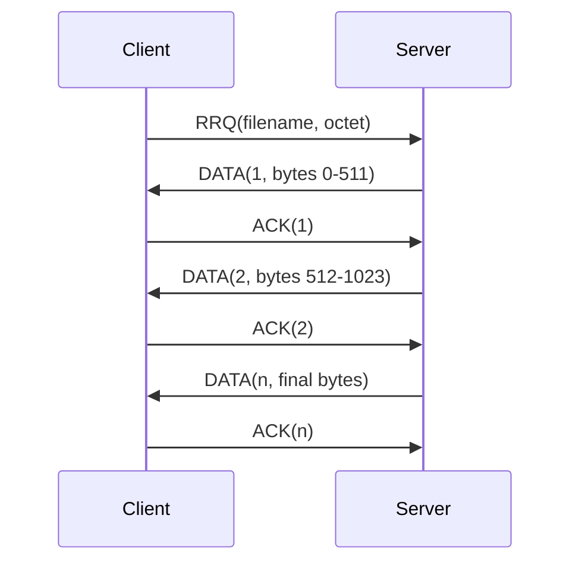
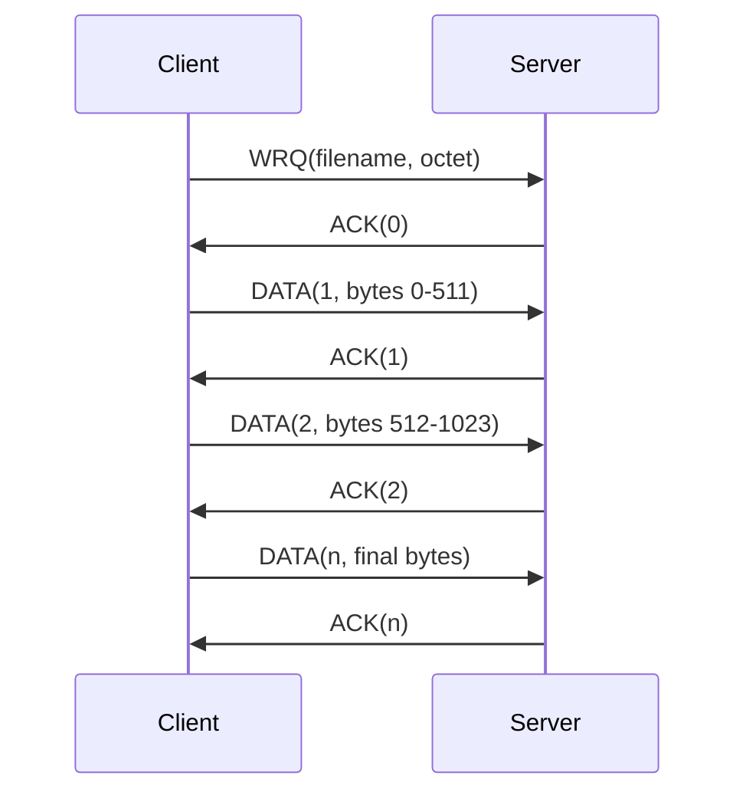

# Protocol Documentation

This project implements a compact TFTP-style protocol over UDP. It uses the standard TFTP packet categories and a local fixed server endpoint:

- Address: `127.0.0.1`
- Port: `61125`
- Transfer mode: `octet`
- Maximum packet size: `516` bytes
- Maximum DATA payload: `512` bytes

## Opcodes

| Name | Value | Meaning |
| --- | ---: | --- |
| `TFTP_RRQ` | `1` | Read request |
| `TFTP_WRQ` | `2` | Write request |
| `TFTP_DATA` | `3` | Data block |
| `TFTP_ACK` | `4` | Acknowledgement |
| `TFTP_ERROR` | `5` | Error response |

## Read Request

In a read request, the client asks to download a file from `server-files/` into `client-files/`.



Read behavior:

- Client command: `./tftp-client r <filename>`
- Client destination: `client-files/<filename>`
- Server source: `server-files/<filename>`
- First DATA block number: `1`
- Completion signal: DATA payload shorter than `512` bytes

If the file does not exist on the server, the server sends an `ERROR` packet.

## Write Request

In a write request, the client uploads a file from `client-files/` into `server-files/`.



Write behavior:

- Client command: `./tftp-client w <filename>`
- Client source: `client-files/<filename>`
- Server destination: `server-files/<filename>`
- Initial server response: `ACK(0)`
- First DATA block number: `1`
- Completion signal: DATA payload shorter than `512` bytes

If the destination file already exists on the server, the server sends an `ERROR` packet instead of overwriting it.

## Packet Shapes

All numeric fields are unsigned 16-bit values written in network byte order.

### RRQ and WRQ

```text
 2 bytes     N bytes   1 byte   N bytes   1 byte
+--------+----------+--------+----------+--------+
| opcode | filename |   0    |   mode   |   0    |
+--------+----------+--------+----------+--------+
```

### DATA

```text
 2 bytes     2 bytes      0-512 bytes
+--------+------------+----------------+
| opcode | block num  |      data      |
+--------+------------+----------------+
```

### ACK

```text
 2 bytes     2 bytes
+--------+------------+
| opcode | block num  |
+--------+------------+
```

### ERROR

```text
 2 bytes      2 bytes       N bytes   1 byte
+--------+--------------+----------+--------+
| opcode | error code   | message  |   0    |
+--------+--------------+----------+--------+
```

## Timeout Model

The shared `sendData` helper sends a packet and waits for the corresponding reply. Before calling `recvfrom`, it arms an alarm with `RETRY_SECONDS`.

If the alarm interrupts `recvfrom`, the timeout handler increments the retry count and the send loop can retransmit the packet. Transfers stop after `MAX_RETRY_COUNT` retries.

## Known Scope

This is an educational local TFTP implementation, not a hardened production TFTP daemon.

- It is configured for localhost.
- It does not implement option extension negotiation.
- It handles requests sequentially.
- It uses relative runtime directories.
- It is meant to be run from the CMake build directory after fixtures are copied.
